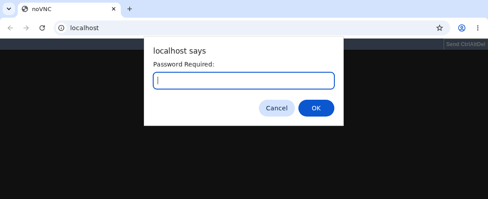
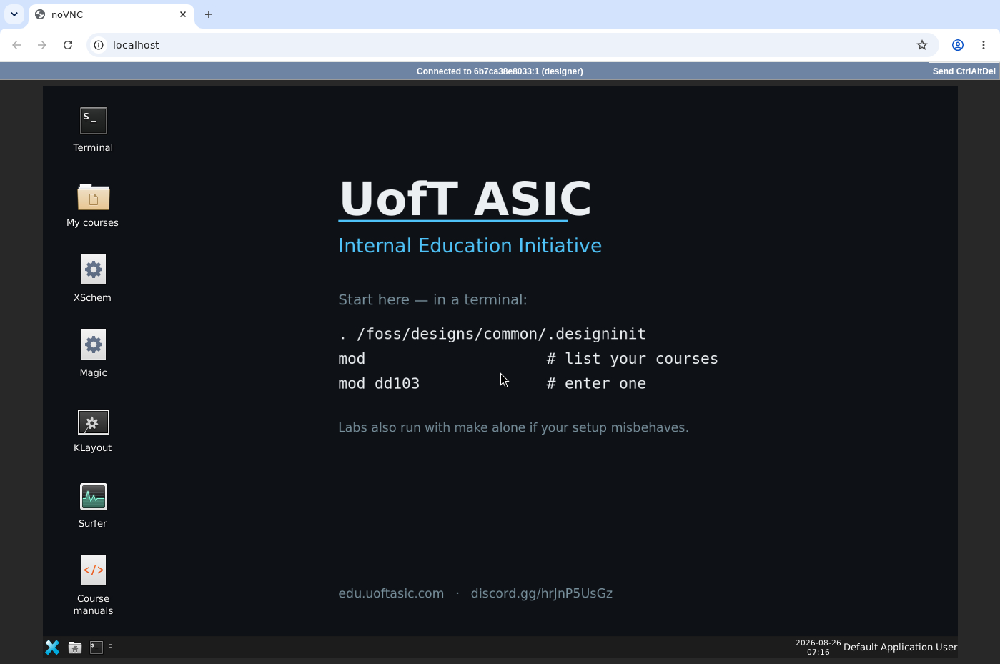

# Launch the IIC-OSIC-TOOLS desktop (noVNC)

This step downloads (clones) the shared **workspace** repo onto your
computer, then starts the containerized EDA desktop in your browser.

## 1. Clone the workspace

**Cloning** means using git to copy a repo from GitHub onto your computer.
Open a terminal (see [Prerequisites](guide/prerequisites.md) if you get
`git: command not found`) and run:

```bash
git clone https://github.com/uoftasic/workspace.git
cd workspace
```

The first command creates a new folder named `workspace` containing the
team's scripts and configuration. The second command moves your terminal
into that folder — every command below assumes you're still inside it.

(Locally we call the folder `workspace`.)

## 2. Start noVNC

This command downloads the container image described in
[Why containers](guide/why-containers.md) (if you don't have it yet) and
starts it.

**macOS / Linux:**

```bash
./scripts/start_vnc.sh
```

**Windows:** double-click `scripts/start_vnc.bat` in File Explorer, or from
a terminal:

```bat
scripts\start_vnc.bat
```

The script will:

1. Pull `hpretl/iic-osic-tools:2026.04` (override with `DOCKER_TAG` if needed)
2. Run the container with your workspace mounted at `/foss/designs`
3. Expose the desktop on **http://localhost/** (port `80` by default; override with `HOST_PORT`)

The first run can take several minutes while the image downloads — this is
normal. Wait for the script to finish before opening the browser.

Useful overrides:

```bash
VNC_RESOLUTION=1920x1080 ./scripts/start_vnc.sh
VNC_PW='your-password' HOST_PORT=8080 ./scripts/start_vnc.sh
```

## 3. Open the desktop

1. Browse to **http://localhost/** (or `http://localhost:<HOST_PORT>/`)

   
   *The address bar says `localhost` and nothing else. If you see a different port, you
   started the container with a different `HOST_PORT`.*

2. Password: **`abc123`** unless you set `VNC_PW`
3. You should see a Linux desktop suitable for XSchem, Magic, terminals, etc.

   
   *The desktop, running inside the browser tab. `Connected to ...` in the top bar means
   the VNC session is live — this is the machine every later course runs on.*

Copy/paste tip: use the clipboard control in the noVNC sidebar, or **Ctrl+Shift+V** to paste into the VM.

## 4. Optional: local X11 instead of noVNC

On Linux (or macOS with XQuartz), `./scripts/start_x.sh` can be faster than streaming the desktop. Prefer noVNC for the standard IC101 path so everyone shares the same UI.

## 5. Stop / restart

```bash
docker rm -f asic-edu-osic   # default container name from start_vnc
```

Then run `start_vnc` again. Your files under the workspace folder persist on the host.

## Checklist

- [ ] Workspace cloned into a `workspace` directory
- [ ] `start_vnc` completed without Docker errors
- [ ] Browser desktop loads and accepts the VNC password
- [ ] You can open a terminal inside the desktop

Next: [Smoke test](guide/smoke-test.md).
